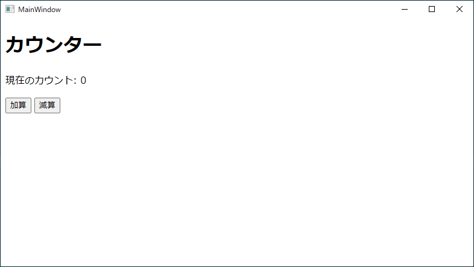

# dotnet_blazor_wpf_on_linux

## 概要
* WPF の UI に BlazorWebView を使用したカウンタアプリのサンプルプログラム
* 公式のサンプルを元にしているが以下の差異がある
  * Visual Studio Code + dotnet CLI を前提としている
  * exe 一つで配布できるよう publish の結果が exe 一つのみになるよう設定している
  * wwwroot なども exe に埋め込まれる
  * Bootstrap を利用しない
  * BlazorWebView の配置を XAML を使わずコードビハインドで完結させている 

※on_linux としたが、Windows 環境でも問題ない

Windows Presentation Foundation (WPF) の Blazor アプリを構築する ※.NET 8  
https://learn.microsoft.com/ja-jp/aspnet/core/blazor/hybrid/tutorials/wpf?view=aspnetcore-8.0  

## 環境
* Docker version 26.1.3, build b72abbb
* mcr.microsoft.com/dotnet/sdk:8.0
* dotnet version 8.0.404
* wpf template version 8.0.11

## 詳細

※ Linux 環境に WPF のテンプレートをインストールする手順など、Linux 環境で WPF の開発をする基本的なことについては [dotnet_wpf_on_linux](https://github.com/Tobotobo/dotnet_wpf_on_linux) を参照

### WPF プロジェクトの作成

```sh
dotnet new wpf
```

プロジェクトファイル( dotnet_blazor_wpf_on_linux.csproj ) の PropertyGroup に以下を追加し restore を実行すｒ。
```xml
<EnableWindowsTargeting>true</EnableWindowsTargeting>
```

```sh
dotnet restore
```

### Blazor を組み込む

#### 手順概要
1. Microsoft.AspNetCore.Components.WebView.Wpf パッケージをプロジェクトに追加
2. プロジェクトファイル( dotnet_blazor_wpf_on_linux.csproj ) に記述の追加・変更
3. _Imports.razor を作成
4. wwwroot フォルダを作成
5. wwwroot/index.html を作成
6. wwwroot/css フォルダを作成
7. wwwroot/css/app.css を作成
8. Counter.razor を作成
9. MainWindow.xaml.cs に記述を追加

#### 1. Microsoft.AspNetCore.Components.WebView.Wpf パッケージをプロジェクトに追加

https://www.nuget.org/packages/Microsoft.AspNetCore.Components.WebView.Wpf
```sh
dotnet add package Microsoft.AspNetCore.Components.WebView.Wpf --version 8.0.100
```
※9.0 以降では Microsoft.Extensions.DependencyInjection が含まれていないのか参照エラーになる。  
　また、BlazorWebView も存在しないエラーになる。要確認  

#### 2. プロジェクトファイル( dotnet_blazor_wpf_on_linux.csproj ) に以下の追加・変更

冒頭の Sdk を以下に変更
```xml
<Project Sdk="Microsoft.NET.Sdk.Razor">
```

PropertyGroup に以下を追加
```xml
<RootNamespace>dotnet_blazor_wpf_on_linux</RootNamespace>

<RuntimeIdentifier>win-x64</RuntimeIdentifier>
<PublishSingleFile>true</PublishSingleFile>
<SelfContained>true</SelfContained>
<DebugType>embedded</DebugType>
<!-- WPF は 2025/1/8 現在 Trimming 非対応 ※https://github.com/dotnet/wpf/issues/3811 -->
<!-- <PublishTrimmed>true</PublishTrimmed> -->
<!-- <TrimMode>partial</TrimMode> -->
<IncludeNativeLibrariesForSelfExtract>true</IncludeNativeLibrariesForSelfExtract>
<PublishReadyToRun>true</PublishReadyToRun>
```

新たに ItemGroup を作成し以下を追加
```xml
<EmbeddedResource Include="wwwroot\**\*" />
<Content Remove="wwwroot\**" />
<Content Remove="global.json" />
```

#### 3. _Imports.razor を作成
```razor
@using Microsoft.AspNetCore.Components.Web
```

#### 4. wwwroot フォルダを作成
```
mkdir wwwroot
```

#### 5. wwwroot/index.html を作成 
```html
<!DOCTYPE html>
<html lang="ja">

<head>
    <meta charset="utf-8" />
    <meta name="viewport" content="width=device-width, initial-scale=1.0" />
    <base href="/" />
    <link href="css/app.css" rel="stylesheet" />
</head>

<body>
    <div id="app">Loading...</div>

    <div id="blazor-error-ui" data-nosnippet>
        An unhandled error has occurred.
        <a href="" class="reload">Reload</a>
        <a class="dismiss">🗙</a>
    </div>
    <script src="_framework/blazor.webview.js"></script>
</body>

</html>
```

#### 6. wwwroot/css フォルダを作成
```
mkdir wwwroot/css
```

#### 7. wwwroot/css/app.css を作成
```css
#blazor-error-ui {
    background: lightyellow;
    bottom: 0;
    box-shadow: 0 -1px 2px rgba(0, 0, 0, 0.2);
    display: none;
    left: 0;
    padding: 0.6rem 1.25rem 0.7rem 1.25rem;
    position: fixed;
    width: 100%;
    z-index: 1000;
}

    #blazor-error-ui .dismiss {
        cursor: pointer;
        position: absolute;
        right: 0.75rem;
        top: 0.5rem;
    }
```

#### 8. Counter.razor を作成
```html
<h1>カウンター</h1>

<p>現在のカウント: @currentCount</p>

<button @onclick="IncrementCount">加算</button>
<button @onclick="DecrementCount">減算</button>

@code {
    private int currentCount = 0;

    private void IncrementCount()
    {
        currentCount += 1;
    }

    private void DecrementCount()
    {
        currentCount -= 1;
    }
}
```

#### 9. MainWindow.xaml.cs に以下を追加

冒頭の using に以下を追加
```cs
using Microsoft.AspNetCore.Components.WebView.Wpf;
using Microsoft.Extensions.DependencyInjection;
using Microsoft.Extensions.FileProviders;
```

MainWindow クラス内に以下のプライベートクラスを追加
```cs
// 埋め込みリソースから wwwroot を取得するカスタム BlazorWebView
private class CustomBlazorWebView : BlazorWebView {
    public override IFileProvider CreateFileProvider(string _)
    {
        // 埋め込みリソースから wwwroot を提供
        EmbeddedFileProvider embeddedFileProvider = new EmbeddedFileProvider(
            Assembly.GetExecutingAssembly(),
            $"{typeof(App).Namespace}.wwwroot");
        return embeddedFileProvider;
    }
}
```

MainWindow コンストラクタの InitializeComponent() の後に以下を追加
```cs
var serviceCollection = new ServiceCollection();
serviceCollection.AddWpfBlazorWebView();
serviceCollection.AddBlazorWebViewDeveloperTools(); // 開発者ツールを有効にする ※F12

// カスタム BlazorWebView をウインドウのメインコンテンツに設定
CustomBlazorWebView customBlazorWebView = new() {
    HostPage="wwwroot/index.html",
    Services=serviceCollection.BuildServiceProvider(),
};
customBlazorWebView.RootComponents.Add(new RootComponent
{
    Selector = "#app",
    ComponentType = typeof(Counter)
});
this.Content = customBlazorWebView;
```

### 実行
```sh
dotnet run
```


### 実行ファイル( exe )生成
```sh
./cmd/build.sh
```
※プロジェクト直下の publish フォルダ内に exe (約180MB) が生成される  
※Windows 環境の場合は Git-Bash で実行する  
